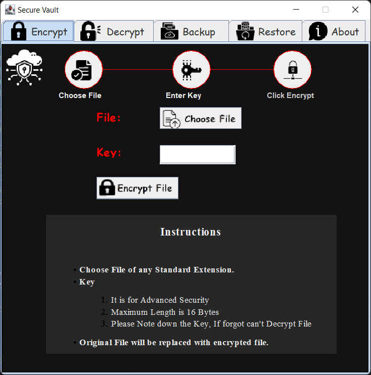
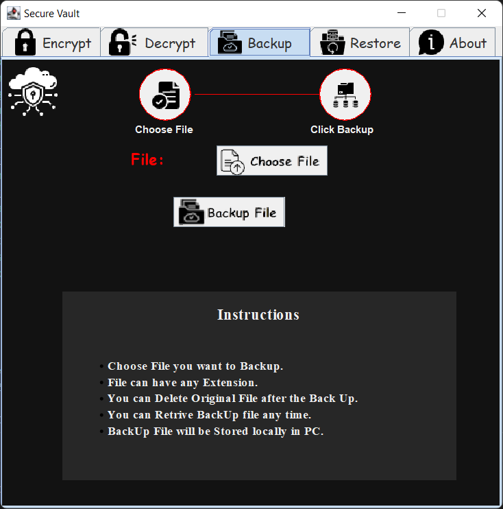
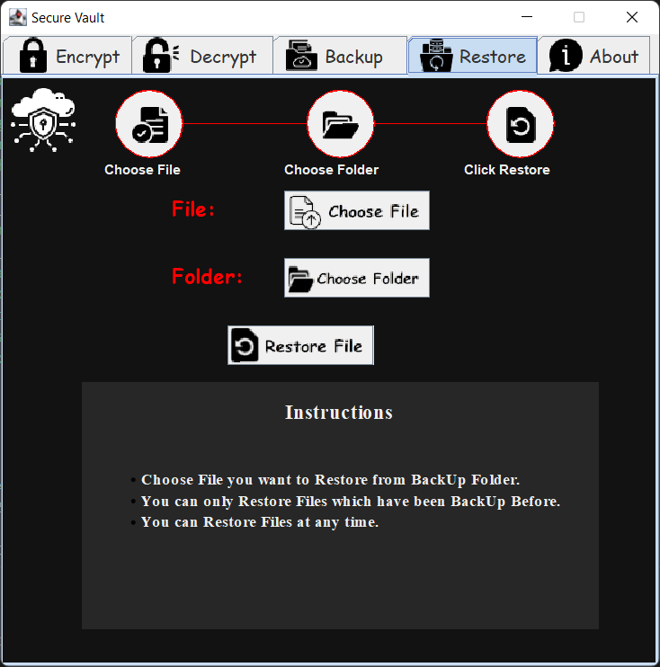
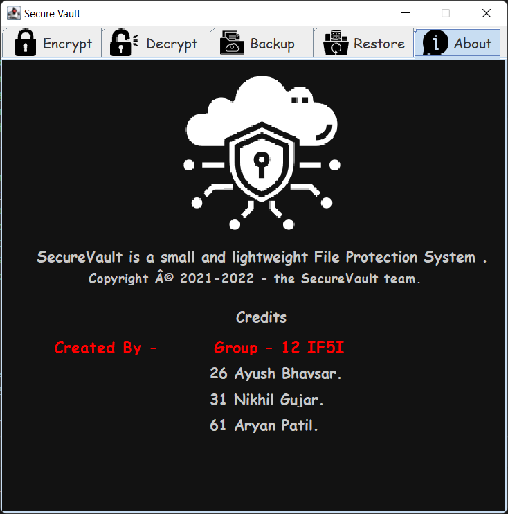

<h1 align="center">


  


<hr>

**File Protection System**
</h1>

## What is Secure Vault?

In this project, we have designed a file security system . When we use the operating system, we have to secure some important data. The date is always stored in the files, so we secure the important files well. To check the proposed functionality, we experiment the above said system on the Windows and Linux based operating system.

> ## ***Run Locally***

- Clone the project

    ```bash
      git clone https://github.com/AryanP45/File-protection-system.git
    ```

- Go to the project directory

    ```bash
      cd File-protection-system
    ```

- Compile Main file

    ```bash
      javac Main.java
    ```

- Run Main file

    ```bash
      java Main
    ```

> ## ***Snapshots***

<center>

### **Encrypt Tab**
  

### **Decrypt Tab**
  

### **Backup Tab**
  

### **Restore Tab**
  

### **About Tab**
  
</center>

## 📝 **Contributing**

Contributions are what make the open source community such an amazing place to be learn, inspire, and create. Any contributions you make are **greatly appreciated**.

1. Fork the Project 
2. Create your Feature Branch (`git checkout -b feature/AmazingFeature`)
3. Commit your Changes (`git commit -m 'Add some AmazingFeature'`)
4. Push to the Branch (`git push origin feature/AmazingFeature`)
5. Open a Pull Request

## ✍️ Authors

- [@AryanPatil](https://www.github.com/AryanP45)
- [@AyushBhavsar](https://www.github.com/AyushBhavsar)

  
<!-- LICENSE -->

## 🏆 License

Distributed under the MIT License. See `LICENSE` for more information.

> ## Related

Here are some related projects

  - [WordBeater](https://github.com/AyushBhavsar/WordBeater)

  - [Android Phone Silencer](https://github.com/AryanP45/Android-phone-silencer)

  - [Expense Manager](https://github.com/AryanP45/AndroidExpenseTracker)

